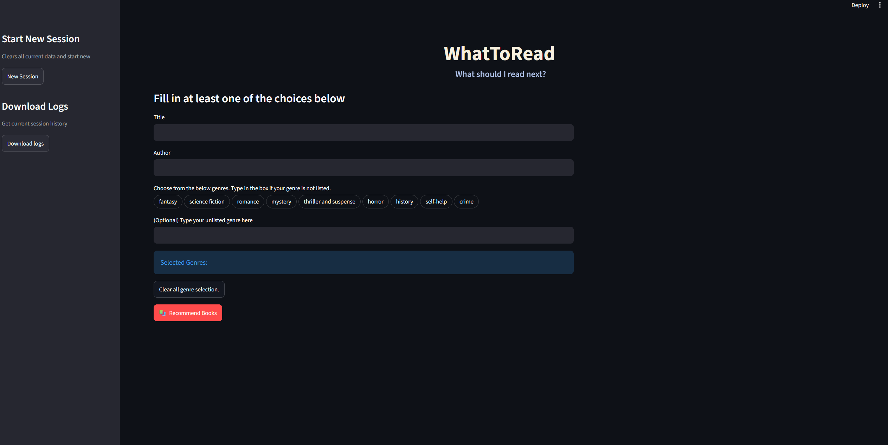

# WhatToRead : Your digital librarian
An AI-powered Streamlit application that recommends books using Google's Gemini AI, enriches results with Tavily web search, and checks library availability via the Singapore National Library Board API.

What if you could ask a librarian anything?
Want "a book similar" to your favourite titles? Craving for a specific genre? This app will recommend books that fit and check if they're available at Singapore's National Library Board libraries. It won't replace serendipity, but it might save you from an hour of indecisive scrolling.

## ✨ Features
- 🤖 AI-generated book recommendations
- 🔍 Tavily web search for additional book information
- ⭐ Personalized recommendations
- 📚 Singapore National Library Board catalogue search
- 📍 Library availability lookup

     

> [!NOTE]
> This project is done in Python 3.14.

| Technology | Purpose                       |
| ---------- | ----------------------------- |
| Python     | Programming language          |
| Streamlit  | Web application               |
| Gemini API | Recommendation generation     |
| Tavily API | Web search                    |
| NLB API    | Book catalogue & availability |


## Screenshot


## Step 1 (Get the files)
- Download or clone this repository

## Step 2 (setup virtual environment and dependencies)
- Create a virtual environment and activate it
  ```
  python -m venv venv
  venv\Scripts\activate
  ```
- install dependencies via requirements.txt
  ```
  # good habit to upgrade pip first
  python -m pip install --upgrade pip
  python -m pip install -r requirements.txt
  ```
## Step 3 (add your api keys)
- Rename .env.example file to .env (check there is no trailing characters after ".env", eg. ".env.txt"
- Open .env file and replace all fields with your api keys
  ```
  GEMINI_API_KEY="Your api key here"
  ```
- You need a NLB api key for this project. Refer to https://go.gov.sg/nlblabs-form

## Step 4 (launch the streamlit program)
```
python -m streamlit run app.py
```
- A pop out window running the app should appear. Else try typing  http://localhost:8501/ (default local url) into your web browser.

## Usage Examples (gif)


## Known Limitations
- NLB Api search results for libraries might be a hit or miss. There is a rate limit of 1 per sec / 15 per minute. To get around this,
  this implementation gets a book found in the database that is most similar to our recommendation. We also only focus on physical books, which lowers the search coverage.
  There is a likely chance there may be no results on library availability at times.
- The results obtained from the web may be skewed towards certain titles if they are widely discussed throughout different platforms. This is because the title's visibility is raised as it appears
  in more online searches

## Future Improvements
- Fix up NLB Api implementation as sometimes there will be no hit or returns on titles despite being available. This can be checked by comparing it to their own website.
- Refine search parameters. Balance the way the user inputs are taken into considering via weights or similar methods as the search result may be widely diverse if contradicting titles and genres are chosen.
   
  


